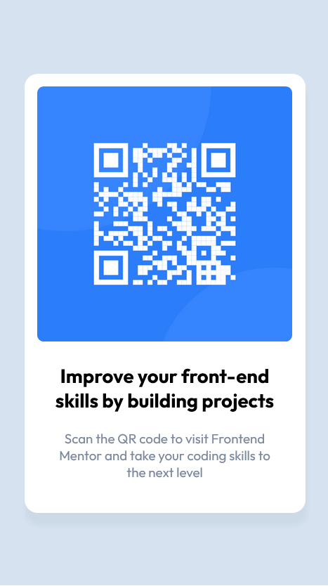
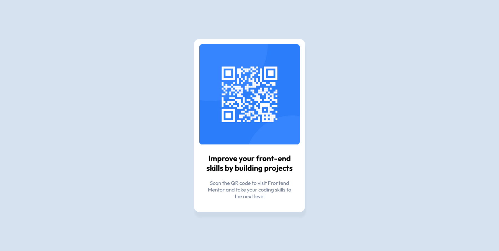

# Frontend Mentor - QR code component solution

This is a solution to the [QR code component challenge on Frontend Mentor](https://www.frontendmentor.io/challenges/qr-code-component-iux_sIO_H).

## Table of contents

- [Overview](#overview)
  - [Screenshot](#screenshot)
  - [Links](#links)
- [My process](#my-process)
  - [Built with](#built-with)
  - [What I learned](#what-i-learned)
  - [Continued development](#continued-development)
  - [Useful resources](#useful-resources)
- [Author](#author)

## Overview

The challenge was to build a QR code component and get the design for both the mobile and desktop versions to look as close as possible to the provided images.

### Screenshot

- Mobile view: 
- Desktop view: 

### Links

- Solution URL: [https://github.com/VTickner/Frontend-Mentor-QR-Code-Component](https://github.com/VTickner/Frontend-Mentor-QR-Code-Component)
- Live Site URL: [Add live site URL here](https://your-live-site-url.com)

## My process

- Created semantic html first
- Used gimp (utilising guides and rulers) to help understand spacing and sizing for various elements of the design using the images provided
- Created CSS selectors to:
  - create custom variables to contain the various colours and font sizes used in the design
  - reset margin and padding to 0 with box-sizing: border-box to help with more accurate size measurements
  - layout the design using flexbox
  - style the various elements
  - create a diffent width layout for desktop version

### Built with

- Semantic HTML5 markup
- CSS custom properties
- Flexbox
- Mobile-first workflow (responsive design)
- Google Fonts

### What I learned

Was able to put into practice recent learning regarding CSS Flexbox and using variables within CSS.

### Continued development

Extra practice using flexbox and integrating it into more complicated designs with CSS grid.

### Useful resources

- [HSL to RGB colour conversion](https://www.rapidtables.com/convert/color/hsl-to-rgb.html) - This helped me to convert the shadow colour from HSL to RGB so that I could use RGBA to create a box shadow on the QR card.
- [PX to REM converter](https://pixelsconverter.com/px-to-rem) - This helped me to convert px font sizes to rem sizes for a more responsive design.
- [Google Fonts](https://fonts.google.com/specimen/Outfit) - Font used in the design was Outfit using Regular 400 and Bold 700 font styles.

## Author

- Frontend Mentor - [@VTickner](https://www.frontendmentor.io/profile/VTickner)
